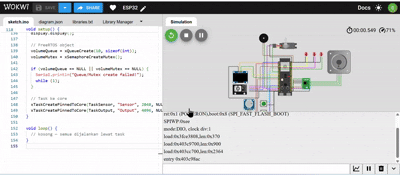

Nama Kelompok : Fransisca Najwa Putri Wibowo , Putri Cahyani Alfaiqoh  
Kelas         : 3 D4 Teknik Komputer A  
NRP           : 3223600003 , 3223600007  

Daftar Sistem (Smart Volume Control Project)

| No | Bagian Sistem        | Peripheral / Fitur        |
|----|-----------------------|----------------------------|
| 1  | OLED Display          | OLED SSD1306 (I2C)        |
| 2  | LED Indikator         | GPIO Output               |
| 3  | Buzzer Alarm          | Alarm             |
| 4  | Potensiometer         | ADC Input (Volume)        |
| 5  | Push Button           | GPIO Input (Mute Toggle)  |
| 6  | FreeRTOS Queue        | Antar-Core Communication  |
| 7  | FreeRTOS Mutex        | Proteksi Variabel Global  |
| 8  | Dual-Core Processing  | Core 0 (Input) & Core 1 (Output) |

--- 

Deskripsi Sistem – Smart Volume Control (Dual Core + FreeRTOS)   
Sistem Smart Volume Control berbasis ESP32 yang menggunakan potensiometer sebagai input untuk mengatur level volume dalam rentang 0–100%. Sistem ini memanfaatkan FreeRTOS multicore, di mana Core 0 bertugas membaca nilai potensiometer dan status tombol mute/unmute, sedangkan Core 1 menangani seluruh output. Nilai volume ditampilkan secara real-time pada OLED dalam bentuk angka dan bar indikator. Selain itu, sistem memberikan respon visual dan audio: LED berkedip dengan kecepatan yang semakin cepat seiring naiknya volume dan buzzer akan aktif otomatis ketika volume melebihi 70% sebagai alarm batas atas. Nantinya juga dapat menekan tombol untuk mengaktifkan fitur mute, yang akan mematikan efek LED dan buzzer serta menampilkan status “MUTED” di OLED. Komunikasi antar-task dilakukan menggunakan Queue untuk pengiriman data volume antar core dan Mutex untuk menjaga konsistensi data saat variabel global diakses secara bersamaan oleh beberapa task.

---

Pembagian Task pada Setiap Core

| Task         | Core | Fungsi Utama                                              | Komponen yang Di-handle       |
|--------------|-----:|------------------------------------------------------------|--------------------------------|
| TaskInput |  0   | Membaca potensiometer, membaca tombol mute, mengirim data via queue | Potensiometer, Push Button     |
| TaskOutput |  1   | Menampilkan data di OLED, blinking LED, mengaktifkan buzzer sesuai volume | OLED, LED, Buzzer              |

---

Mapping Hardware

| Perangkat        | Pin ESP32-S3 | Mode   | Di-handle oleh Core |
|------------------|-------------:|--------|----------------------|
| Potensiometer | GPIO 3       | ADC     | Core 0               |
| Push Button   | GPIO 13     | Input   | Core 0               |
| OLED SDA     | GPIO 17      | I2C     | Core 1 (TaskOutput)  |
| OLED SCL    | GPIO 8       | I2C     | Core 1 (TaskOutput)  |
| LED Indikator | GPIO 5       | Output  | Core 1               |
| Buzzer     | GPIO 13      | Output    | Core 1               |

---

| Komponen  | Fungsi                                                               | Digunakan Oleh             | Keterangan Multicore                                                                                                                                                         |
| --------- | -------------------------------------------------------------------- | -------------------------- | ---------------------------------------------------------------------------------------------------------------------------------------------------------------------------- |
| Queue | Mengirim data *volume* & status *mute* dari Core 0 → Core 1          | `TaskInput` → `TaskOutput` | Digunakan sebagai sarana komunikasi antar-core. Core 0 mengirim hasil pembacaan potensiometer dan tombol, sedangkan Core 1 menerima data untuk update OLED, LED, dan buzzer. |
| Mutex | Melindungi variabel global seperti `volumeValue` dari race condition | Core 0 & Core 1            | Saat kedua core dapat mengakses variabel yang sama, mutex memastikan hanya satu core yang membaca/menulis pada suatu waktu sehingga data tetap aman dan konsisten.           |

---

Langkah Percobaan
1. Menyusun rangkaian hardware dengan menghubungkan:
- Potensiometer ke pin ADC ESP32-S3
- Push button sebagai input mute
- OLED SSD1306 via I2C
- LED indikator ke pin GPIO
- Buzzer sebagai output
2. Membuat program utama dengan membagi sistem menjadi dua task:
a. Core 0 → TaskInput
    - Membaca potensiometer (volume)
    - Membaca tombol mute
    - Mengirim data ke Core 1 melalui queue
b. Core 1 → TaskOutput
    - Menerima data volume dari queue
    - Menampilkan status ke OLED
    - Mengatur LED berkedip sesuai level volume
    - Mengaktifkan buzzer jika volume >70% dan tidak mute
3. Menggunakan FreeRTOS Queue sebagai media pertukaran data antar-core agar data volume selalu konsisten, terjadwal, dan bebas konflik.
4. Menggunakan FreeRTOS Mutex untuk melindungi variabel global volumeValue agar tidak terjadi kondisi race saat Core 0 menulis dan Core 1 membaca.
5. Mengamati hasil percobaan, meliputi:
- Perubahan tampilan OLED sesuai volume dan status mute
- LED berkedip semakin cepat saat volume meningkat
- Buzzer berbunyi hanya jika volume tinggi dan mute OFF
- Log monitoring pada Serial Monitor
6. Lakukan Dokumentasi

---

Tools
| Komponen  | Detail              |
| --------- | ------------------- |
| Board     | ESP32-S3            |
| IDE       | Wokwi               |
| Framework | FreeRTOS            |
| Bahasa    | C / C++             |

---

Simulasi Wokwi : https://wokwi.com/projects/447222444492476417  
Demo  

